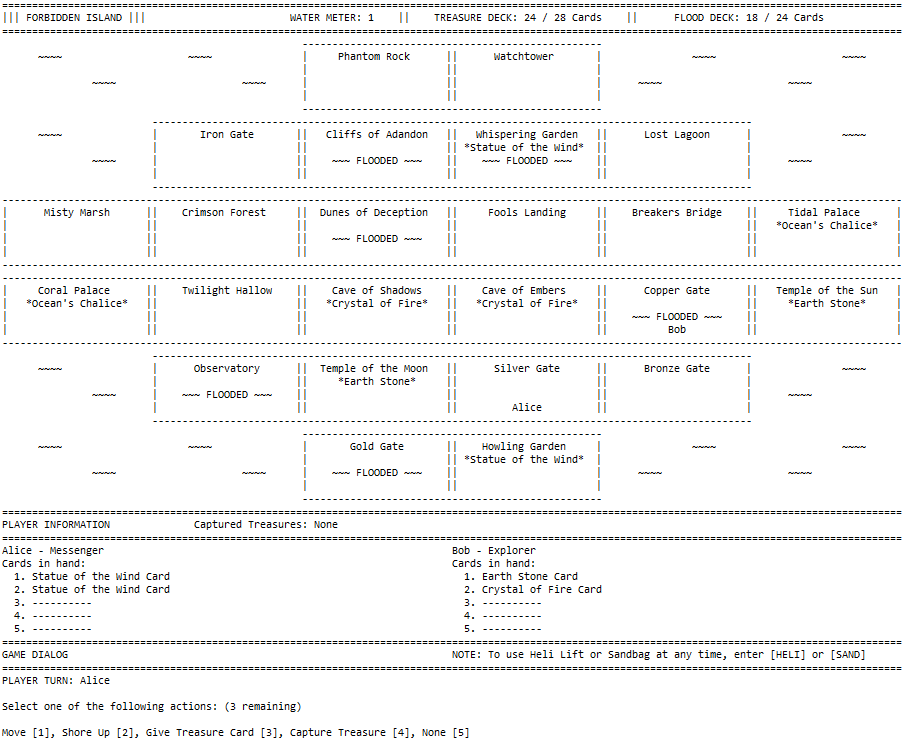

# ForbiddenIsland

A Java implementation of the Forbidden Island board game.

Authors: Eoghan O'Shea and Robert McCarthy

### System modelling

A collection of images generated when moddeling this application can be found in the 'docs/system_modelling_images' folder. The actual models can be found in the relevant packages in the 'src' directory.

### Gameplay

This is an application with a terminal user interface, the recommended display dimensions are 58 rows and 150 columns. This will allow for a full view of the game's display.

